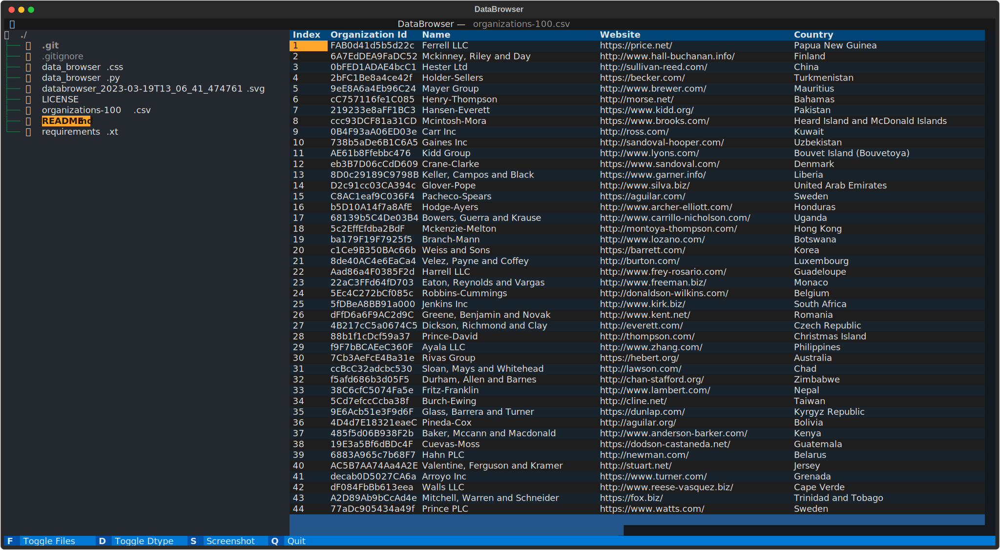
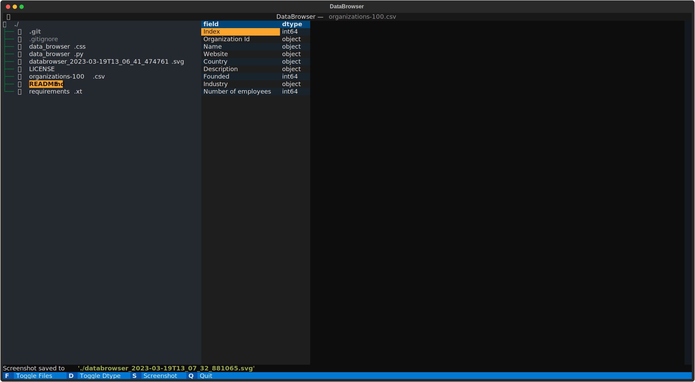

# databrowser

A easy file browser to view data files.

Currently supports parquet,json and csv with the Pandas library

_Based on the example code_browser from Textual._

## Install

Execute `poetry install` to install the package and the dependencies

Run `python3 src/databrowser/data_browser.py`
or run `poetry run databrowser` to execute in virtual env

## Usage

`python3 data_browser.py [optional path]`

_S3 Support_

with the help of S3Path and S3fs the browser now supports s3.

use `python3 data_browser.py s3://` to start browsing buckets

or `python3 data_browser.py s3://bucket/path/subdir/` to browse a specific directory.

it uses the default aws credentials in the environment

Select a data file to view

* press F to hide the filebrowser
* press D to show the dtypes
* press S to save a screenshot in svg

* press Q to quit

## examples

